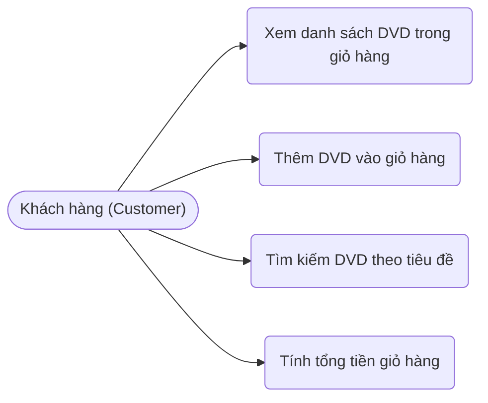

# Sơ đồ Use Case – AIMS-mini

```mermaid
flowchart LR
    Customer(["Khách hàng (Customer)"])
    UC1("Xem danh sách DVD trong giỏ hàng")
    UC2("Thêm DVD vào giỏ hàng")
    UC3("Tìm kiếm DVD theo tiêu đề")
    UC4("Tính tổng tiền giỏ hàng")

    Customer --> UC1
    Customer --> UC2
    Customer --> UC3
    Customer --> UC4
```
